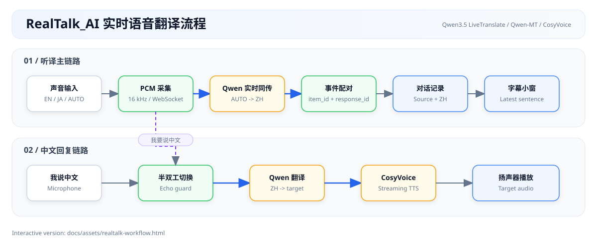

# RealTalk_AI

**面对面实时语音翻译桌面应用。** 对方说英语或日语，你看中文；你说中文，对方听到选定的外语。

[](LICENSE)
[](https://www.python.org/downloads/)
[](#快速开始)

基于 [阿里云百炼](https://bailian.console.aliyun.com/)（DashScope）的 Qwen 实时同传、文本翻译与 CosyVoice 语音合成。API Key 只从环境变量读取，仓库内不含任何真实凭证。

> 当前版本 **0.2.0**（Alpha）。听译链路（英/日 → 中文）与中文回复朗读（默认英语）已在 Windows 上实测可用。

## 功能

- **一键听译**：`开始检测` 后自动识别对方语种（英语、日语等），实时显示原文与中文译文
- **中文回复**：`我要说中文` 将你的话翻译并合成为对方语言朗读；支持重放
- **字幕模式**：置顶小窗，只显示当前一句，方便对照视频或直播
- **窗口透明度**：滑杆调节 50%–100%，叠在播放器边上不挡画面
- **双路输入**：本机麦克风，或 Windows WASAPI 回环采集系统播放声音
- **半双工会话**：听与说不同时占用识别连接，播放译文时静音上行，避免回声循环
- **命令行探针**：不启动 GUI 即可检查配置、设备与三个模型是否可用

## 项目流程



流程分为两条链路：上方将对方语音或系统声音实时转成中文记录与字幕；下方在用户点击「我要说中文」后切换通道，将中文翻译并合成为外语播放。两条链路半双工运行，避免扬声器回声再次进入识别。

Archify 交互版本保存在 [`docs/assets/realtalk-workflow.html`](docs/assets/realtalk-workflow.html)，下载后可在浏览器中查看、缩放和追踪关系；可编辑规范见 [`realtalk-workflow.json`](realtalk-workflow.json)。

## 界面怎么用

1. 选择回复语言与音色、对方声音来源（系统回环或麦克风）、你的麦克风。
2. 点击 **开始检测**，对方的语音会逐句显示：小字是原文，大字是中文。
3. 需要开口时点 **我要说中文**；说完再点按钮回到听译。
4. 看视频或直播时打开 **字幕模式**，窗口缩小并置顶；**退出字幕** 恢复完整界面。

同一时间只开一条实时连接：听译为「外语 → 中文」，回复为「中文 → 外语」。

## 快速开始

### 环境

- Python 3.10+
- 麦克风与扬声器（翻译电脑播放的声音时，Windows 需能枚举 WASAPI 回环设备）
- 已开通[阿里云百炼](https://bailian.console.aliyun.com/)的账号

### 获取 API Key

在[百炼控制台](https://bailian.console.aliyun.com/)开通服务，打开「API-KEY」创建密钥。说明见官方文档：[获取 API Key](https://help.aliyun.com/zh/model-studio/get-api-key)。

新用户通常有北京地域模型的免费额度（约 90 天）。本项目默认模型均在该地域。

### 安装

建议使用虚拟环境，避免 `dashscope` 与其他项目的 protobuf / rich 冲突：

```bash
git clone https://github.com/magau123/RealTalk_AI.git
cd RealTalk_AI

python -m venv .venv
# Windows PowerShell
.venv\Scripts\Activate.ps1
# macOS / Linux
source .venv/bin/activate

python -m pip install -r requirements.txt
```

Linux 还需安装 PortAudio：

```bash
sudo apt-get install libportaudio2
```

### 配置

```bash
# Windows PowerShell
Copy-Item .env.example .env
# macOS / Linux
cp .env.example .env
```

编辑 `.env`，将 `DASHSCOPE_API_KEY` 换成你的密钥。该文件已被 `.gitignore` 忽略。

### 检查与启动

```bash
python -m realtalk.cli check    # 探测配置、音频设备与三个模型（会产生极少量调用）
python main.py                  # 启动图形界面
```

`check` 对识别、翻译、合成**分别探测**：某一个模型额度用尽不会中断整次检查。

## 技术选型

语音链路走百炼而非智能语音交互（NLS），主要因为：单 Key 鉴权、参数即可切换语种、一条 WebSocket 同时给出识别与翻译。NLS 按项目绑定识别模型，对话里中外切换会非常笨重。

| 环节 | 模型 / 库 | 作用 |
|---|---|---|
| 实时识别 + 翻译 | [`qwen3.5-livetranslate-flash-realtime`](https://help.aliyun.com/zh/model-studio/qwen-livetranslate-python-sdk) | 听译主路径；内置 `qwen3-asr-flash-realtime` |
| 文本翻译 | [`qwen-mt-flash`](https://help.aliyun.com/zh/model-studio/qwen-mt-api)（失败则降级） | 中文 → 外语补译 |
| 语音合成 | [`cosyvoice-v2`](https://help.aliyun.com/zh/model-studio/cosyvoice-python-sdk) | 流式 PCM 播放；音色按回复语言选择 |
| 采集 / 播放 | `sounddevice`，Windows 另用 `PyAudioWPatch` | 麦克风与 WASAPI 回环 |

LiveTranslate 会话只取文本，不使用其预置音色 Tina。回复语音一律走 CosyVoice。

### 翻译降级

百炼免费额度**按模型独立计算**。`qwen-mt-flash` 额度用尽时，`qwen-mt-plus` 往往仍可用。`TextTranslator` 仅在额度/权限类错误时沿 `flash → plus → turbo` 降级，并把结果缓存；超时或 5xx 不换模型，以免掩盖故障。也可在 `.env` 中写死：

```bash
REALTALK_MT_MODEL=qwen-mt-plus
```

## 语种

听译不指定源语种（`auto`），由实时模型识别。回复方向必须**同时**满足：可译成中文、中文可译回该语种、且有 CosyVoice 系统音色。交集由 `languages.conversation_languages()` 计算，当前为：

| 回复语言 | CosyVoice 音色 |
|---|---|
| 英语 | Eva、Brian、Luna、Luca、Emily、Eric（英式） |
| 日语 | Yuuna、Yuuma、Tomoka、Tomoya |
| 韩语 | Jihun、Kyong |

西班牙语等语种翻译矩阵允许、但 `cosyvoice-v2` 没有系统音色，因此不会出现在回复列表中。接入 `cosyvoice-v3` 声音复刻后可以扩展。

## 架构

```
麦克风 / WASAPI 回环
        │  16 kHz PCM
        ▼
Qwen3.5 LiveTranslate  ──►  原文 + 中文译文  ──►  对话记录 / 字幕
        │
        │  轮到「我说」时
        ▼
Qwen-MT（必要时）  ──►  CosyVoice  ──►  扬声器
```

- `realtalk.core` 不依赖 Qt；GUI 与 CLI 共用同一套会话逻辑。
- 听译与回复半双工切换：翻译目标语言在建连时固定，不能在一条连接上改方向。
- 播放译文时用静音帧替换麦克风数据（仍持续发送），避免扬声器回灌，也避免超过服务端约 23 秒无音频断连。

```
RealTalk_AI/
├── main.py
├── realtalk/
│   ├── config.py              # 仅从环境 / .env 读配置
│   ├── languages.py           # 语种、翻译矩阵、音色
│   ├── cli.py
│   ├── audio/                 # 采集、重采样、PCM 播放
│   ├── core/
│   │   ├── conversation.py    # 半双工对话
│   │   ├── qwen_listen.py     # LiveTranslate 会话
│   │   ├── listen.py          # Gummy 兼容封装
│   │   ├── translator.py      # Qwen-MT 与降级
│   │   ├── tts.py
│   │   └── events.py
│   └── ui/                    # PySide6
└── tests/                     # 不依赖真实 API Key
```

跨线程约定：PortAudio 回调只入队、不发网络；SDK 回调经 Qt Signal 进 UI 线程；`start_turn()` 在后台线程执行以免卡住界面。

## 命令行

```bash
python -m realtalk.cli check
python -m realtalk.cli devices
python -m realtalk.cli voices

python -m realtalk.cli listen --source en
python -m realtalk.cli listen --source ja
python -m realtalk.cli listen --device 5

python -m realtalk.cli speak "洗手间在哪里？" --target en
python -m realtalk.cli check -v
```

## 配置

优先级：进程环境变量 > `.env` > 代码默认值。

| 变量 | 必填 | 默认 | 说明 |
|---|---|---|---|
| `DASHSCOPE_API_KEY` | 是 | — | 百炼 API Key |
| `REALTALK_ASR_MODEL` | 否 | `qwen3.5-livetranslate-flash-realtime` | 实时识别与翻译 |
| `REALTALK_MT_MODEL` | 否 | `qwen-mt-flash` | 文本翻译 |
| `REALTALK_TTS_MODEL` | 否 | `cosyvoice-v2` | 语音合成 |
| `REALTALK_MAX_END_SILENCE` | 否 | `800` | VAD 静音断句（毫秒，200–6000） |
| `REALTALK_WEBSOCKET_URL` | 否 | — | 业务空间专属 WebSocket，一般不用 |

`REALTALK_MAX_END_SILENCE` 同时影响断句速度和翻译质量：切得过碎时模型看不到整句上下文。默认 800ms 是实测后的折中，不建议为了「更快出字」降到 400ms 以下。

## 安全

- Key 只来自环境或 `.env`，占位值会被拒绝
- `.env` 已忽略；`.env.example` 仅含占位串
- `Settings` 的 `repr` 与界面只显示脱敏 Key
- 测试覆盖 Key 不出现在 `repr` 和控件文本中

提交前请确认工作区没有真实密钥：

```bash
git status --short
git diff --cached
```

## 常见问题

**403 `Free quota exhausted`**  
该模型免费额度用尽。额度按模型独立计算，跑 `check` 可看到其余模型是否仍可用。翻译会自动降级；若候选全部用尽，需在控制台充值，或关闭「仅使用免费额度」。

**找不到音频设备**  
执行 `python -m realtalk.cli devices`。Windows 还需在「设置 → 隐私和安全性 → 麦克风」允许桌面应用访问。

**断句太长或太碎**  
调整 `REALTALK_MAX_END_SILENCE`。400–500ms 更积极，1500ms 以上更适合完整陈述。

**对方听到自己的话又被翻译了一遍**  
回声。播放时应已静音上行；若仍出现，降低外放或改用耳机。

**安装后其他项目依赖冲突**  
在虚拟环境中安装本项目。

## 开发

```bash
python -m pip install -r requirements.txt
python -m pip install pytest ruff

# Windows PowerShell
$env:QT_QPA_PLATFORM="offscreen"
pytest -q
ruff check realtalk tests
```

测试不访问真实 API。改 `languages.py` 中的翻译矩阵前，请对照[实时识别文档](https://help.aliyun.com/zh/model-studio/real-time-python-sdk)；抄错一个方向会导致该语种译文静默为空。

### 实现上依赖实测、文档未写清的行为

- LiveTranslate 将原文与译文分成 `item_id` / `response_id` 两条流；不能按 `speech_started` 计数，否则连续语音会停在第一个词。
- 尾部静音可能下发仅含空白的 `response`，展示前必须 `strip()`。
- `TranslationRecognizerRealtime.stop()` 无超时，异常时可能永久阻塞；关闭时在守护线程中限时等待。
- 识别器实例 `stop()` 后不可复用。
- 服务端约 23 秒收不到音频会断开，故静音期仍发送静音帧。

## 路线图

- [ ] 西语 / 法语 / 德语等回复音色（`cosyvoice-v3` 声音复刻）
- [ ] 对话记录导出
- [ ] 热词（人名、地名、术语）
- [ ] 端到端延迟统计

## 许可

本项目以 [MIT License](LICENSE) 发布。

## 参考文档

- [Qwen LiveTranslate Python SDK](https://help.aliyun.com/zh/model-studio/qwen-livetranslate-python-sdk)
- [Gummy 实时语音识别与翻译](https://help.aliyun.com/zh/model-studio/real-time-python-sdk)
- [Qwen-MT](https://help.aliyun.com/zh/model-studio/qwen-mt-api)
- [CosyVoice SDK](https://help.aliyun.com/zh/model-studio/cosyvoice-python-sdk)
- [CosyVoice 音色列表](https://help.aliyun.com/zh/model-studio/cosyvoice-voice-list)
- [获取 API Key](https://help.aliyun.com/zh/model-studio/get-api-key)
